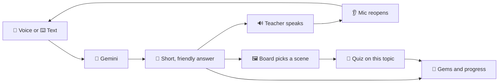

 

 

**[Overview](#-overview) · [Problem](#-problem) · [Solution](#-solution) · [Screenshots](#-screenshots) · [Live demo](#-live-demo) · [Features](#-features) · [How it works](#-how-it-works) · [Tech stack](#-tech-stack) · [Getting started](#-getting-started) · [Author](#-author) · [License](#-license)**

---

## 🧠 Overview

**EduMind** is a 3D virtual classroom where a teacher answers your questions out loud and draws the explanation on a chalkboard while talking.

I built it for students in Grades 5–10 following the Bangladesh curriculum. You can speak or type in **Bangla or English**, and the teacher replies in the same language. The whole thing is a single HTML file with no build step and no backend.

> Most study apps give you a wall of text. EduMind gives you a classroom: a teacher who talks, a board that animates, and a quiz at the end.

---

## 🎯 Problem

Students in Grades 5–10 who ask an AI tool for help usually get a wall of text back. Many of these tools assume English, and the conversation ends when the answer is sent: nothing checks whether the explanation landed.

A student who is already struggling with a topic gets the least help from a format that asks for the most reading.

---

## 💡 Solution

EduMind turns a question into a short lesson: the teacher explains it aloud, the board shows the idea, and a quiz checks it.

| Problem | How EduMind handles it |
|---|---|
| Text-only answers are hard to hold onto | The teacher speaks, and the board animates the idea while she explains |
| Most tools are built English-first | Bangla and English, switchable at any time. The teacher answers in the language you chose |
| Nothing checks whether it stuck | A short quiz on the topic you just covered, with gems and a streak to bring you back |
| AI tools often need accounts, installs or servers | One HTML file that opens in the browser. Demo mode works without any key |

---

## 📸 Screenshots

The teacher explaining Earth–Moon and Earth–Sun distances, with the animated board and chat panel open.

---

## 🌐 Live demo

**[Open EduMind in your browser](https://sarowarsuman.github.io/EduMind_3D_Platform_for_Child/)**

Use Chrome for voice. Demo mode runs without a key, and a free Gemini key in Settings switches on live AI answers.

---

## ✨ Features

| | Feature | What it does |
|---|---|---|
| 🏫 | **3D classroom** | A full room built with Three.js: desks, chairs, wall clock, globe, cork boards, a sunlit window and floating dust. Drag to look around. |
| 👩‍🏫 | **Talking teacher** | A 3D teacher with a speaking animation. Click her and she waves and greets you. Choose from three teachers: **Queen**, **Abubokkor** and **Rupa**. |
| 🎤 | **Voice conversation** | Press the mic and ask. The answer is read aloud, then the mic reopens by itself so you can keep talking. |
| 🖼️ | **Live animated board** | The board picks a visual that fits your question and animates it while the teacher explains. |
| 🎯 | **AI quiz** | Generates a short multiple-choice quiz on the topic you just learned, with instant feedback. |
| 💎 | **Gems and streaks** | Learning earns gems. Topics learned and your daily streak sit in the top bar. |
| 🌐 | **Bangla and English** | Switch language any time with one button. |
| 🔑 | **Demo mode** | Works without a key using built-in replies and quizzes. Add a free Gemini key for real answers. |

### 🖼️ Board topics

The board picks one of these animated scenes from what you ask:

<b>Open the full list</b>

 

| Scene | Triggered by |
|---|---|
| 🪐 Solar system | planets, space, moon, stars |
| ☀️ Space distances | distance to the Sun or Moon, light-years, conjunctions |
| ⚛️ Atom | atoms, molecules, electrons, elements, acids and bases |
| 🌱 Photosynthesis | photosynthesis, chlorophyll, green plants |
| 🌧️ Water cycle | rain, clouds, evaporation |
| 💧 Journey of drinking water | where our water comes from, filtering, H₂O |
| 🍎 Newton's laws | force, motion, gravity, inertia, friction |
| 🍕 Fractions | fractions, numerator, denominator |
| 📈 Graphs | graphs, sin and cos, equations, geometry |
| 📝 Generic summary board | everything else: the key points of the answer |

---

## 🔄 How it works

1. You ask a question by voice or text.
2. Gemini replies in 3–5 simple sentences with an example and a question to think about.
3. The teacher reads the answer aloud and the board animates a matching scene.
4. The mic reopens so the conversation keeps going.
5. One tap starts a quiz on what you just learned.

---

## 🧰 Tech stack

| Layer | Technology |
|---|---|
| 3D rendering | [Three.js](https://threejs.org) r128 |
| AI | Google Gemini API, with automatic fallback across several Flash models |
| Voice | Web Speech API for recognition and synthesis |
| Board graphics | HTML5 Canvas, animated frame by frame |
| Storage | Browser `localStorage` |
| Fonts | Hind Siliguri and Poppins |
| Architecture | One self-contained HTML file with no build step |

### Why these choices

Every choice follows one rule: a learner should be able to open a link and start, with nothing to install, host or pay for.

| Choice | Why I picked it | What I ruled out | Trade-off I accepted |
|---|---|---|---|
| **Vanilla JavaScript, one HTML file** | Mic, speech, 3D and canvas are all browser features, so the browser is the natural home. No install, no server, no build step. | **Python / Django:** needs a hosted server and still needs JavaScript for the 3D scene and mic. **React / Vue:** a build pipeline for a single-screen app. **Native or Unity app:** install friction and heavy downloads. | One large file is harder to maintain than modules. |
| **Three.js (CDN)** | Lightweight, well documented, runs wherever WebGL does. The classroom and teacher are built from basic shapes in code, so there are no model files to download. | **Unity WebGL:** large download, slow start. **Babylon.js:** a full game engine, more than one classroom needs. **Raw WebGL:** too low-level for this scope. | The teacher is stylised, not photoreal. |
| **Google Gemini API** | The free tier lets a student try it with their own key at no cost, and it handles Bangla. The app tries several Gemini models in order, so one hitting its limit does not stop the lesson. | **Paid models:** a cost barrier for students. **Local or self-hosted LLM:** will not run on a typical student device. | Free quota can run out, and the app then falls back to demo mode. The key lives in the user's browser, which suits personal use rather than a shared deployment. |
| **Web Speech API** | Built into the browser: no extra service to set up or pay for. | **Cloud speech-to-text:** needs a backend, keys and billing. | Best in Chrome. Voice quality and Bangla voice availability vary by device. |
| **Canvas 2D for the board** | Each scene is drawn in code, animated frame by frame and used as a texture on the 3D board. Labels switch with the language, and the scenes add almost nothing to file size. | **Pre-rendered video or GIFs:** heavy and fixed to one language. **Asking the AI to generate drawing code:** slower, unpredictable and unsafe to execute. | Ten hand-built scenes. Other topics get a generic summary board. |
| **Keyword routing for scenes** | The topic is matched to a scene by rules, so the board appears instantly and behaves the same every time, with no second AI call. | **AI-based topic classification:** extra delay and quota on every question. | New scenes need their keywords added by hand. |
| **Browser `localStorage`** | Gems, streak and topic count persist with no accounts and no database. | **Firebase or a backend database:** authentication and hosting for a feature that does not need them. | Progress stays on one browser and device. |

---

## 🚀 Getting started

**1. Open the file in Chrome.**
Voice input and the teacher's voice rely on the browser's Web Speech API, which works best in Chrome.

**2. Ask your first question.**
Demo mode is on by default, so you can try everything right away.

**3. Turn on real AI answers (free).**

<b>Get a Gemini API key</b>

 

1. Go to [aistudio.google.com](https://aistudio.google.com)
2. Click **Get API key** and create a new key
3. Open **⚙️ Settings** in EduMind and paste the key
4. Press **Save + Test**, and the status light in the top bar turns green

> 🔒 **Privacy.** Your key is saved in your own browser (`localStorage`) and is only sent to Google's Gemini API. There is no server in between.

### 🎛️ Settings

| Option | Description |
|---|---|
| 🔑 Gemini API key | Switches from demo mode to live AI |
| 👂 Auto-listen | Reopens the mic after each answer |
| 🔊 Teacher voice | Turns spoken answers on or off |
| 🔄 Change teacher | Cycles through Queen, Abubokkor and Rupa |
| 🗑️ Reset progress | Clears gems, topics and streak |

---

## 👤 Author

**Suman**
Software Engineering, Daffodil International University, Bangladesh

---

## 📄 License

Released under the **MIT License**. See the [LICENSE](LICENSE) file for details.

 

**If EduMind helped you learn something, leave a ⭐ on the repo.**

