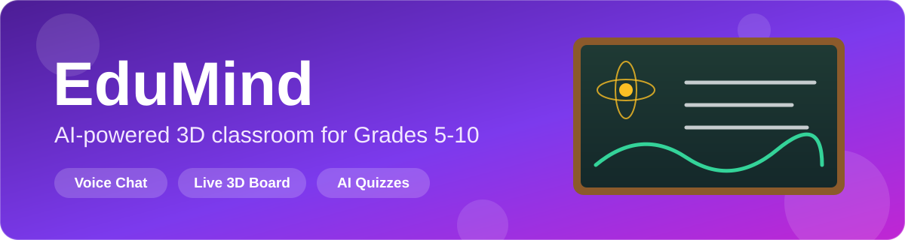
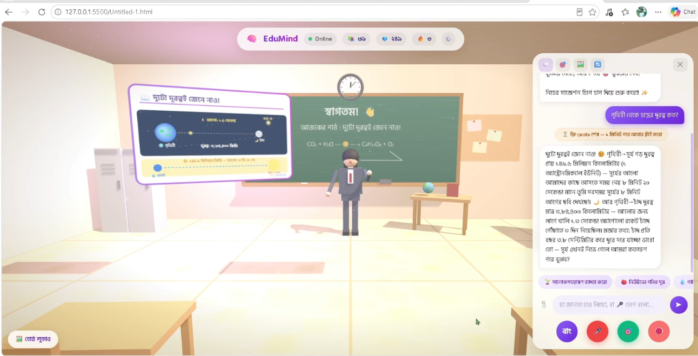
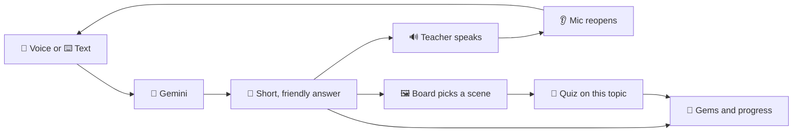

(https://github.com/user-attachments/files/33077717/README.2.md)

 

 

**[Overview](#-overview) · [Preview](#-preview) · [Features](#-features) · [How it works](#-how-it-works) · [Getting started](#-getting-started) · [Tech stack](#-tech-stack) · [Author](#-author) · [License](#-license)**

---

## 🧠 Overview

**EduMind** is a 3D virtual classroom where a teacher answers your questions out loud and draws the explanation on a chalkboard while talking.

I built it for students in Grades 5–10 following the Bangladesh curriculum. You can speak or type in **Bangla or English**, and the teacher replies in the same language. The whole thing is a single HTML file with no build step and no backend.

> Most study apps give you a wall of text. EduMind gives you a classroom: a teacher who talks, a board that animates, and a quiz at the end.

---

## 🎬 Preview

The teacher explaining Earth–Moon and Earth–Sun distances, with the animated board and chat panel open.

---

## ✨ Features

| | Feature | What it does |
|---|---|---|
| 🏫 | **3D classroom** | A full room built with Three.js: desks, chairs, wall clock, globe, cork boards, a sunlit window and floating dust. Drag to look around. |
| 👩‍🏫 | **Talking teacher** | A 3D teacher with a speaking animation. Click her and she waves and greets you. Choose from three teachers: **Queen**, **Abubokkor** and **Rupa**. |
| 🎤 | **Voice conversation** | Press the mic and ask. The answer is read aloud, then the mic reopens by itself so you can keep talking. |
| 🖼️ | **Live animated board** | The board picks a visual that fits your question and animates it while the teacher explains. |
| 🎯 | **AI quiz** | Generates a short multiple-choice quiz on the topic you just learned, with instant feedback. |
| 💎 | **Gems and streaks** | Learning earns gems. Topics learned and your daily streak sit in the top bar. |
| 🌐 | **Bangla and English** | Switch language any time with one button. |
| 🔑 | **Demo mode** | Works without a key using built-in replies and quizzes. Add a free Gemini key for real answers. |

### 🖼️ Board topics

The board picks one of these animated scenes from what you ask:

<b>Open the full list</b>

 

| Scene | Triggered by |
|---|---|
| 🪐 Solar system | planets, space, moon, stars |
| ☀️ Space distances | distance to the Sun or Moon, light-years, conjunctions |
| ⚛️ Atom | atoms, molecules, electrons, elements, acids and bases |
| 🌱 Photosynthesis | photosynthesis, chlorophyll, green plants |
| 🌧️ Water cycle | rain, clouds, evaporation |
| 💧 Journey of drinking water | where our water comes from, filtering, H₂O |
| 🍎 Newton's laws | force, motion, gravity, inertia, friction |
| 🍕 Fractions | fractions, numerator, denominator |
| 📈 Graphs | graphs, sin and cos, equations, geometry |
| 📝 Generic summary board | everything else: the key points of the answer |

---

## 🔄 How it works

1. You ask a question by voice or text.
2. Gemini replies in 3–5 simple sentences with an example and a question to think about.
3. The teacher reads the answer aloud and the board animates a matching scene.
4. The mic reopens so the conversation keeps going.
5. One tap starts a quiz on what you just learned.

---

## 🚀 Getting started

**1. Open the file in Chrome.**
Voice input and the teacher's voice rely on the browser's Web Speech API, which works best in Chrome.

**2. Ask your first question.**
Demo mode is on by default, so you can try everything right away.

**3. Turn on real AI answers (free).**

<b>Get a Gemini API key</b>

 

1. Go to [aistudio.google.com](https://aistudio.google.com)
2. Click **Get API key** and create a new key
3. Open **⚙️ Settings** in EduMind and paste the key
4. Press **Save + Test**, and the status light in the top bar turns green

> 🔒 **Privacy.** Your key is saved in your own browser (`localStorage`) and is only sent to Google's Gemini API. There is no server in between.

### 🎛️ Settings

| Option | Description |
|---|---|
| 🔑 Gemini API key | Switches from demo mode to live AI |
| 👂 Auto-listen | Reopens the mic after each answer |
| 🔊 Teacher voice | Turns spoken answers on or off |
| 🔄 Change teacher | Cycles through Queen, Abubokkor and Rupa |
| 🗑️ Reset progress | Clears gems, topics and streak |

---

## 🧰 Tech stack

| Layer | Technology |
|---|---|
| 3D rendering | [Three.js](https://threejs.org) r128 |
| AI | Google Gemini API, with automatic fallback across several Flash models |
| Voice | Web Speech API for recognition and synthesis |
| Board graphics | HTML5 Canvas, animated frame by frame |
| Storage | Browser `localStorage` |
| Fonts | Hind Siliguri and Poppins |
| Architecture | One self-contained HTML file with no build step |

---

## 👤 Author

**Sarowar Suman**
Software Engineering, Daffodil International University, Bangladesh

---

## 📄 License

Released under the **MIT License**. See the [LICENSE](LICENSE) file for details.

 

**If EduMind helped you learn something, leave a ⭐ on the repo.**

